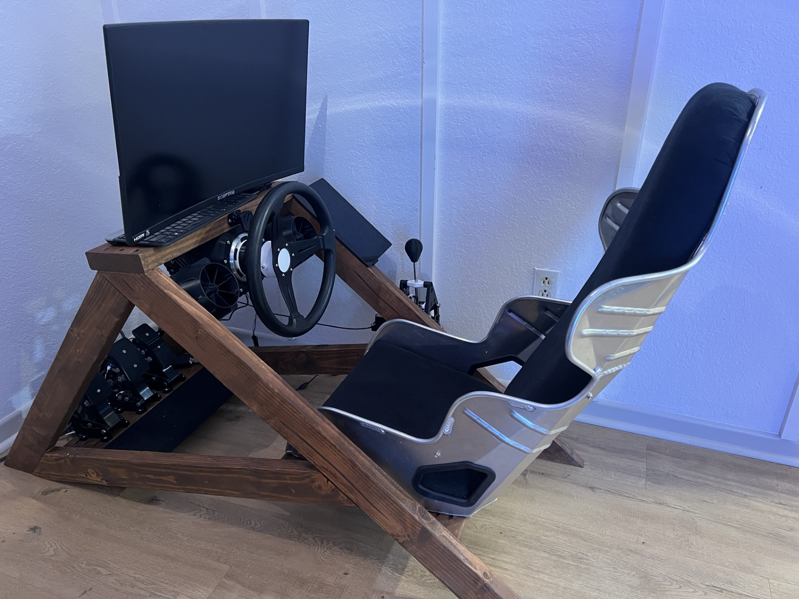
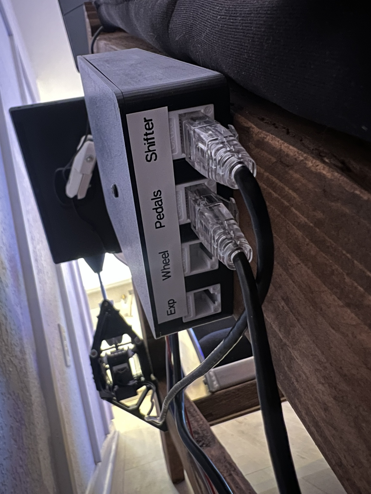
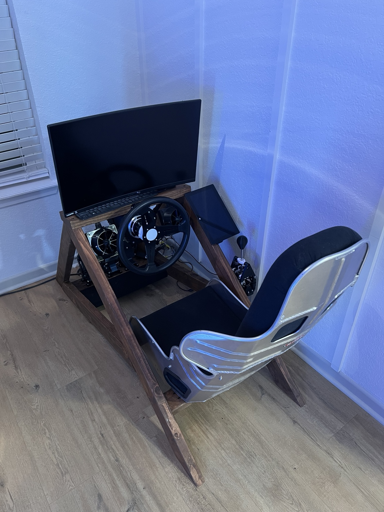
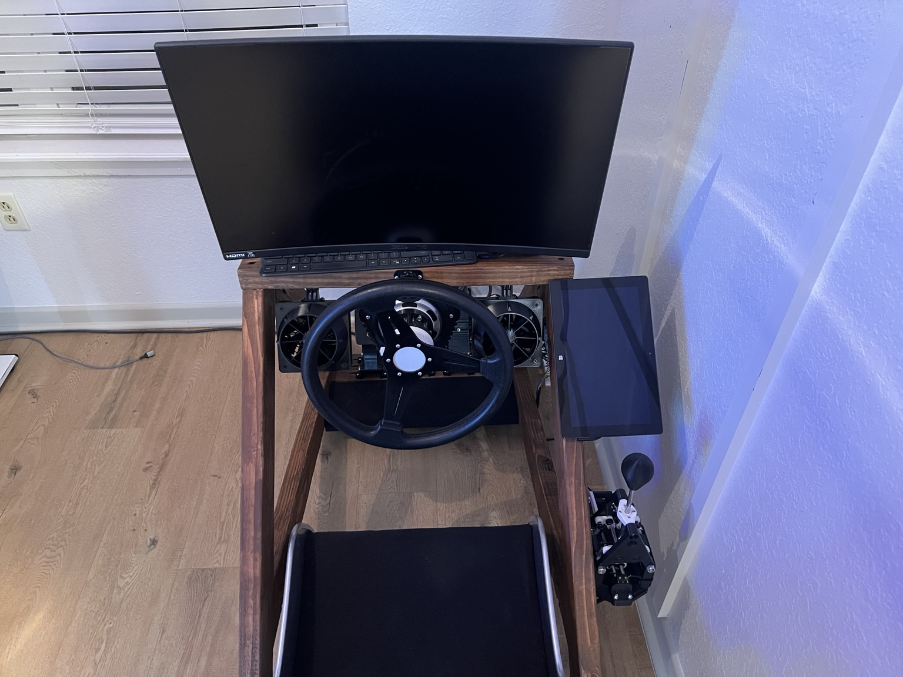
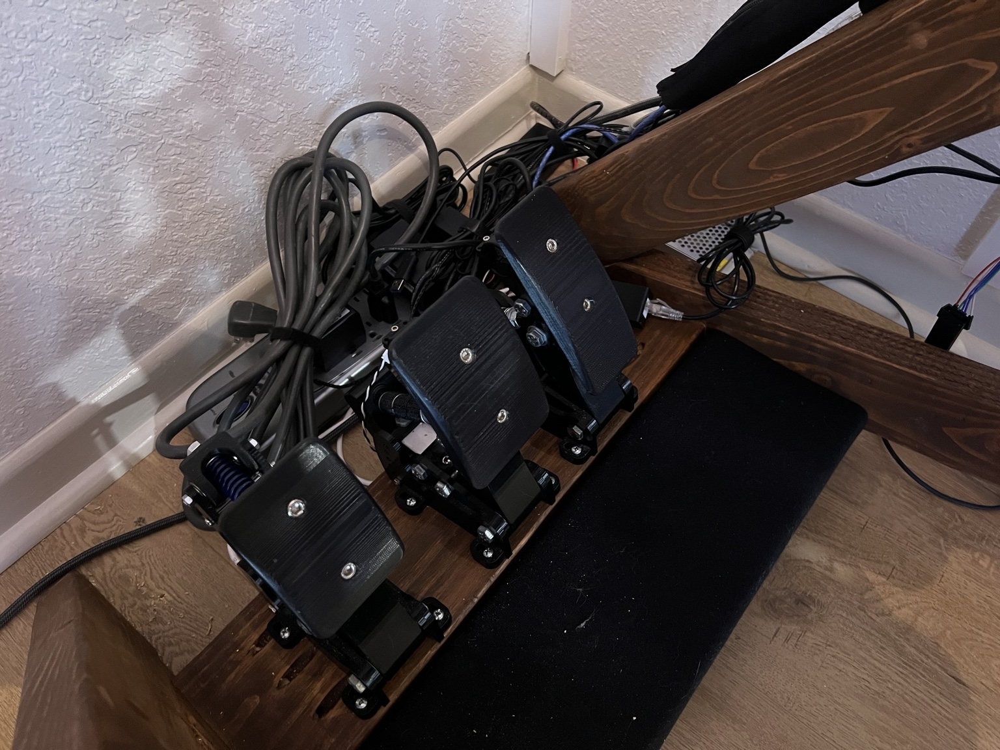
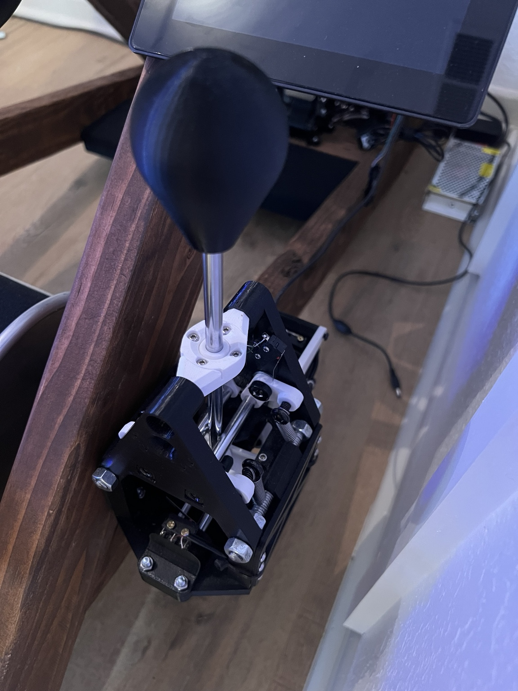
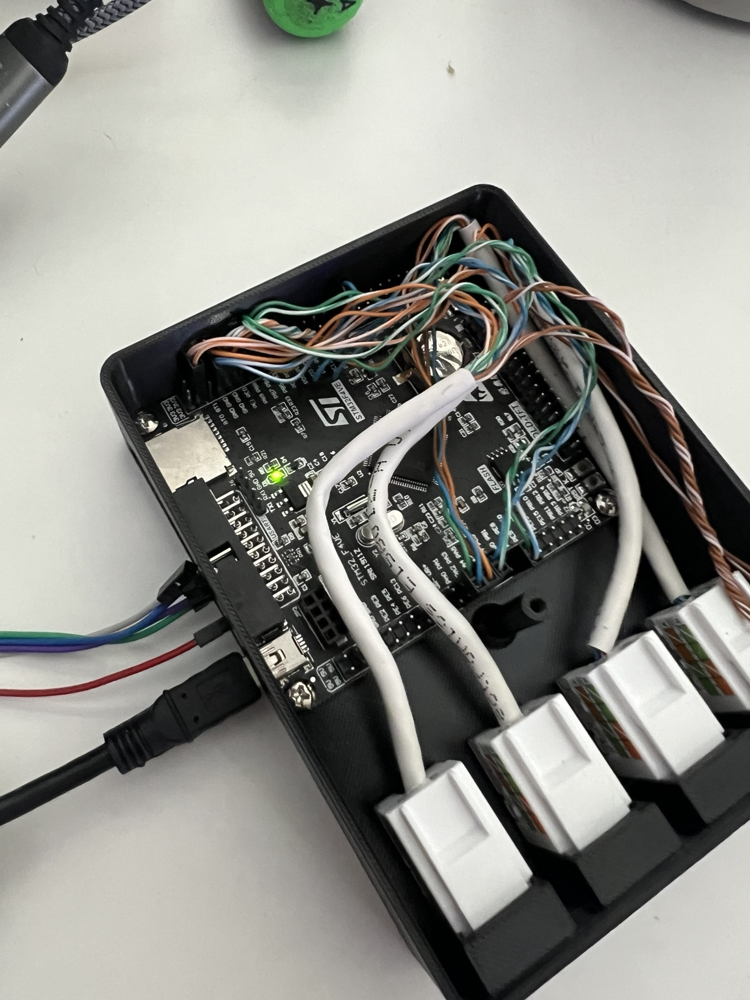
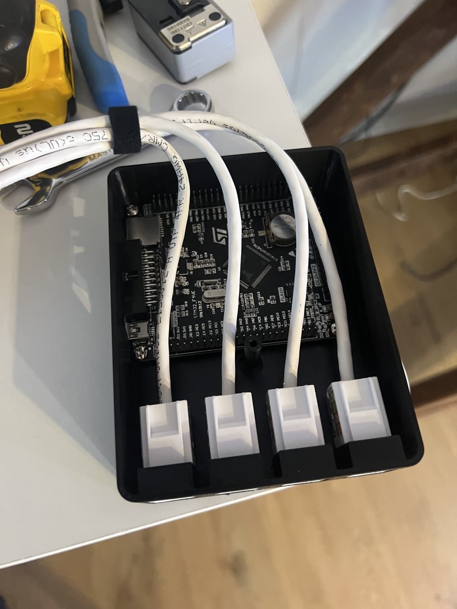

# AdaptSim

### A modular DIY direct drive sim racing ecosystem built from accessible parts, custom CAD, and open-source hardware.

---

# Overview

AdaptSim is a DIY sim racing project centered around a custom STM32 controller, direct drive force feedback wheel, load-cell pedals, H-pattern shifter, pedal rumble system, and SimHub-powered wind simulation.

The goal of this project was simple:

> Build a high-performance simulator using affordable components, recycled hardware, 3D printed parts, and custom CAD rather than expensive proprietary equipment.

Everything was designed around adaptability. The included STEP files are intended to be modified and customized to fit whatever hardware you have available.

---

# Design Philosophy

AdaptSim is **not a kit**.

The parts used in this build were largely chosen based on what I already had available. Because of that, exact hardware counts and dimensions may differ from your build.

Instead of requiring exact replicas, the provided STEP files allow builders to:

- Modify dimensions
- Change mounting patterns
- Use different hardware
- Adapt electronics layouts
- Customize ergonomics

If you have different bearings, springs, fasteners, sensors, or materials, modify the CAD and make it your own.

---

# Features

## Direct Drive Wheel

- 350W Hoverboard Motor
- 36V Rated Motor
- 15 Pole Pair Configuration
- MT6701 Magnetic Encoder
- FFBeast Firmware
- STM32-based controller
- SimHub Compatible

## Load Cell Pedals

- Custom modified pedal design
- 200kg load cell brake
- HX711 load cell amplifier
- KY-035 analog hall sensors
- Magnetic throttle and clutch sensing
- Adjustable geometry
- Adjustable pedal spacing

## H-Pattern Shifter

- Fully custom CAD design
- Magnetic centering mechanism
- Reverse lockout
- Limit switch gear detection
- Serviceable design

## Modular Electronics

- STM32F407VET6 controller
- RJ45 modular wiring system
- Dedicated wheel port
- Dedicated pedal port
- Dedicated shifter port
- Expansion port for future accessories

## SimHub Integration

- Dual pedal rumble motors
- Speed-based wind simulation
- Drafting effects
- Left/right airflow effects

---

# Rig Overview

The simulator frame is a simple wood construction designed around affordability and rigidity.

Major systems include:

- Direct drive wheel
- Load-cell pedals
- H-pattern shifter
- SimHub wind simulator
- Pedal rumble feedback
- STM32 controller system

---

# Direct Drive Wheel

## Hardware

| Component | Description |
|------------|-------------|
| Motor | 6.5" Hoverboard Motor |
| Rated Power | 350W |
| Voltage | 36V |
| Pole Pairs | 15 |
| Encoder | MT6701 Magnetic Encoder |
| Controller | FFBeast |
| Power Supply | 24V 10A |

---

# Pedals

## Sensors

### Throttle

- KY-035 Analog Hall Sensor
- 8mm x 3mm Neodymium Magnet

### Clutch

- KY-035 Analog Hall Sensor
- 8mm x 3mm Neodymium Magnet

### Brake

- 200kg Load Cell
- HX711 Amplifier Module

## Construction

- PETG Printed Components
- 608 Bearings
- M5 Threaded Rod
- M6 Hardware
- 5/16" Hardware

---

# H-Pattern Shifter

The shifter was designed from scratch in CAD and developed around readily available hardware and linear motion components.

## Hardware

| Qty | Component |
|------|------------|
| 4 | KW11-3Z-C Limit Switches |
| Assorted | 8mm Linear Rod |
| 4 | 8mm Linear Bearings |
| Assorted | M3 Hardware |
| Assorted | M4 Hardware |
| Assorted | M6 Threaded Rod |
| Assorted | M8 Threaded Rod |
| Assorted | 5/16" Threaded Rod |
| Assorted | Heat Set Inserts |
| Assorted | Extension Springs |

---

# Electronics Architecture

The entire simulator is built around a STM32F407VET6 microcontroller and a modular RJ45 wiring system.

## Ports

| Port | Function |
|--------|----------|
| Wheel | Wheel Controls |
| Pedals | Pedal Sensors |
| Shifter | Gear Detection |
| Expansion | Future Accessories |

Using RJ45 cabling allows easy serviceability and future expansion without rewiring the entire simulator.

---

# Pedal Rumble System

## Hardware

| Component | Description |
|------------|-------------|
| Controller | Arduino Pro Micro |
| Driver | DRV8833 Dual H-Bridge |
| Motors | Xbox Controller Rumble Motors (2x) |
| Power Supply | 5V 2A USB Supply |

## SimHub Effects

- Wheel Slip
- ABS Feedback
- Wheel Lock
- Engine Vibration
- Road Impacts

---

# Wind Simulation

## Hardware

| Component | Description |
|------------|-------------|
| Controller | Arduino Pro Micro |
| Fans | Thermalright TL-C12C PWM |
| Quantity | 2 |
| Voltage | 12V |
| Speed | 1550 RPM |
| Power Supply | 12V 1A |

## SimHub Effects

- Vehicle Speed
- Airflow Curving
- Drafting Effects

---

# CAD Files

The repository includes STEP files for:

- Pedals
- H-Pattern Shifter
- STM32 Controller Enclosure

Only STEP files are provided.

This allows builders to import and modify the designs in virtually any CAD software.

---

## Opening the Project

This repository intentionally omits some STM32CubeIDE workspace metadata files.

To open the project:

1. Open `AdaptSim_STM32.ioc` in STM32CubeMX
2. Generate code
3. Open the generated project in STM32CubeIDE
4. Build and flash

All required source code is included in this repository.

---

# Credits

## Pedal Design Inspiration

This project began with the excellent pedal design by:

https://www.printables.com/model/1394243-sim-racing-pedals-with-load-cell-v2

The pedal assemblies in this repository are heavily modified versions adapted to fit this simulator's specific requirements.

---

## Shifter Inspiration

The shifter was inspired by:

https://dazprojects.com/products/h-shifter-3d-models

No files, models, or CAD data were purchased, downloaded, or reused. The design included here was created independently from scratch.

---

## Wind Simulator Credits

The wind simulator used in this project is based on the excellent design created by:

https://makerworld.com/en/models/1561872-3d-printed-wind-simulator-kit-for-sim-racing

I used their printed fan mounts and wind simulation design directly in my build because it is a well-designed and easy-to-implement solution.

The only significant modification was the electronics enclosure and controller implementation. Instead of the original Arduino Uno based design, this project uses an Arduino Pro Micro integrated into the overall AdaptSim electronics ecosystem.

The original creator's files are not included in this repository. If you would like to build the wind simulator, please visit their MakerWorld page and download the files directly from the original source.

Thank you to the original designer for making the project available to the community.

---

# License

This project is released under the MIT License.

Build it. Modify it. Improve it. Share it.

🏁
